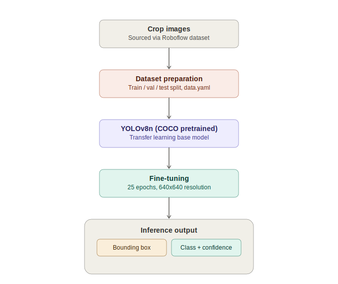
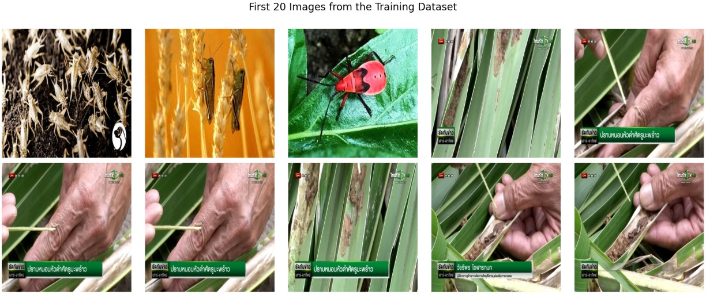
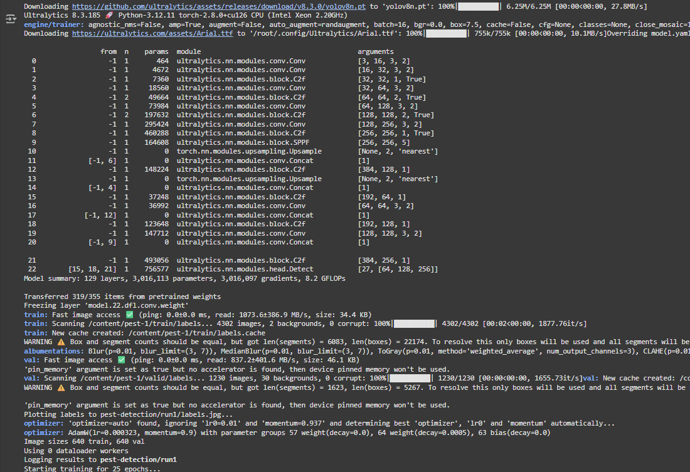
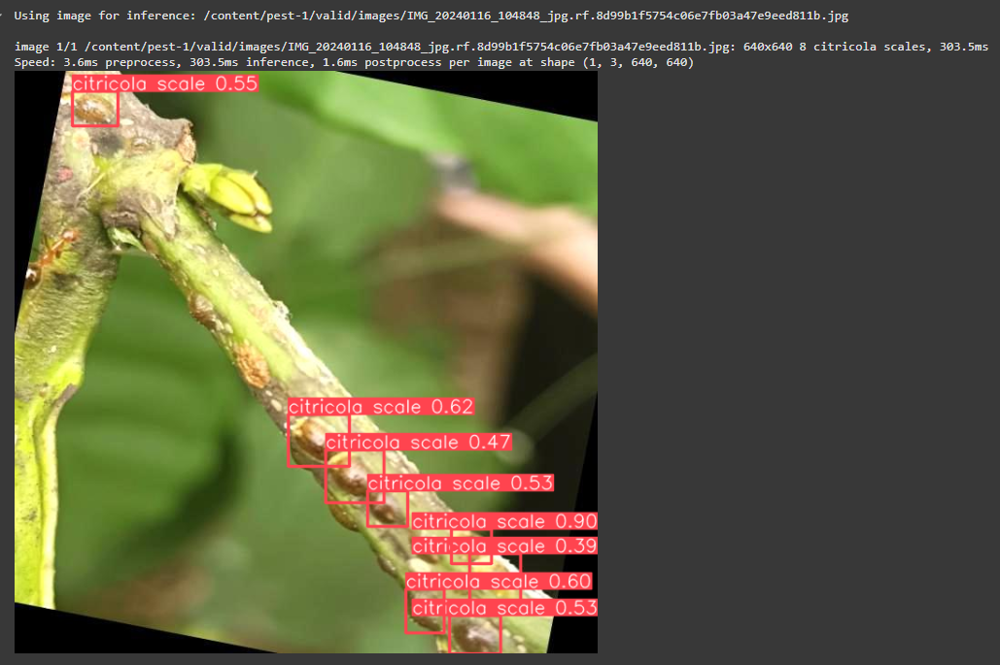

# Pest Detection in Crops Using YOLOv8 Object Detection

A real-time object detection system that identifies and classifies crop pests from images, built on YOLOv8 with transfer learning from COCO weights — designed to support early pest detection and reduce reliance on manual crop inspection.

---

## The Problem

Pest infestation is a major driver of crop yield loss worldwide. Traditional pest monitoring relies on manual inspection by agricultural workers or experts — a process that is slow, labor-intensive, and prone to human error, especially for small or camouflaged pests that are easy to miss with the naked eye.

**Goal:** Build a lightweight, accurate model that can automatically detect and classify pests directly from crop images, enabling faster intervention and more sustainable pesticide use.

## The Approach



1. **Dataset acquisition** — pest image dataset sourced and version-controlled via Roboflow, pre-structured into train/validation/test splits in YOLOv8 format
2. **Transfer learning** — rather than training from scratch, the model starts from `yolov8n.pt` (YOLOv8 nano, pre-trained on the 80-class COCO dataset), which drastically reduces training time and data requirements
3. **Training** — fine-tuned for 25 epochs at 640×640 resolution, with training tracked for precision, recall, and mAP (mean Average Precision)
4. **Inference** — the best-performing weights (`best.pt`) are used to detect pests in unseen validation images, drawing bounding boxes with class labels and confidence scores

## Sample Dataset



## Results





The model successfully detects and localizes pests in crop images, annotating each detection with a class label and confidence score (e.g. "Aphid: 92%"), demonstrating that a lightweight YOLOv8 model can perform effective real-time pest detection even on modest hardware.

## Tools & Techniques
- **YOLOv8 (Ultralytics)** — object detection architecture (anchor-free, multi-scale detection)
- **Roboflow** — dataset hosting, annotation format, and version management
- **PyTorch** — underlying training framework, with automatic GPU/CPU fallback
- **Transfer learning** — fine-tuning COCO-pretrained weights on a custom pest dataset
- **Matplotlib / PIL** — visualization of dataset samples and detection results

## Repository Structure
```
├── train.py     # Training pipeline: dataset download + YOLOv8 fine-tuning
├── detect.py    # Inference pipeline: run detection on new/unseen images
├── docs/
│   └── project_report.pdf
└── images/
    ├── pipeline_diagram.png
    ├── sample_dataset.jpg
    ├── training_results.png
    └── detection_output.png
```


## Future Scope
- Expand to a larger, more diverse pest dataset across multiple crop types
- Integrate with drone or IoT-based field monitoring for real-time surveillance
- Deploy as a mobile-friendly tool for on-the-spot field diagnosis

## Skills Demonstrated
- Object detection model training and fine-tuning (YOLOv8)
- Transfer learning to reduce data/compute requirements
- End-to-end computer vision pipeline: data acquisition → training → inference → visualization
- Working with cloud-hosted dataset tools (Roboflow) and reproducible ML pipelines
